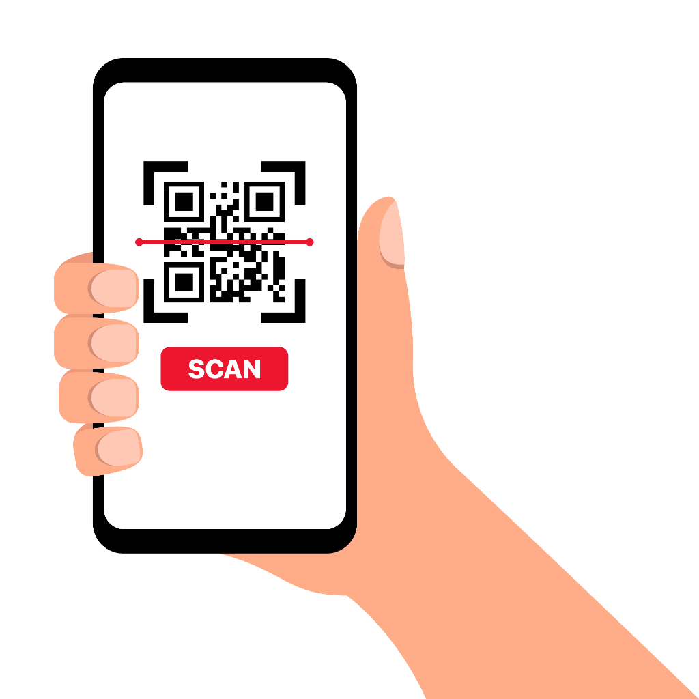

# 📦 Aplikasi Resi Scanner

Aplikasi Progressive Web App (PWA) modern yang dirancang khusus untuk mempermudah dan mempercepat verifikasi resi pengiriman (AWB) dari manifest kargo berbentuk PDF.



## ✨ Fitur Utama

### 📄 Parsing PDF Cerdas
- **Ekstraksi Otomatis**: Secara otomatis mendeteksi dan mengambil nomor resi (contoh: `SPXID...`, `JX...`, kode 12 digit) dari file manifest PDF yang diupload.
- **Share Target**: Fitur "Bagikan" / "Share" file PDF langsung dari WhatsApp atau File Manager ke aplikasi ini (Fitur PWA Android).
- **Mode Debug**: Opsi untuk melihat teks mentah hasil pembacaan PDF jika ada masalah.

### 📷 Scanner Canggih
- **Kamera Terintegrasi**: Scanner Barcode dan QR Code bawaan yang cepat menggunakan `html5-qrcode`.
- **Input Manual**: Kolom input cadangan untuk mengetik kode resi jika barcode rusak atau tidak terbaca.
- **Pencocokan Kilat**: Langsung mencocokkan kode yang discan dengan daftar resi dari PDF.
- **Anti Duplikat**: Memberikan peringatan suara dan visual jika resi sudah pernah discan sebelumnya.

### 🎨 Tampilan Modern (UI/UX)
- **Desain Mobile-First**: Tata letak yang dimaksimalkan untuk penggunaan di HP, tombol mudah dijangkau jari.
- **Indikator Visual**: Progress bar, tanda centang hijau, dan pesan error warna merah yang jelas.
- **Tema**: Menggunakan gaya "Modern Logistics" yang bersih dan profesional.

### 🔊 Sistem Suara Interaktif
- **5 Pilihan Tema SuaraUnik**:
  - 🎵 **Modern**: Suara 'ting' digital yang enak didengar.
  - 📟 **Classic**: Suara 'beep' scanner minimarket jadul.
  - 👾 **Arcade**: Efek suara game retro 8-bit.
  - ☁️ **Soft**: Nada lembut dan tidak berisik.
  - 🤖 **Robot**: Efek suara futuristik/metalik.
- **Text-to-Speech**: Aplikasi akan berbicara "Sudah Lengkap" secara otomatis ketika semua resi berhasil discan.
- **Pengaturan Tersimpan**: Aplikasi mengingat pilihan suara Anda walaupun browser ditutup.

## 🚀 Cara Install (PWA)

Aplikasi ini adalah PWA, jadi bisa diinstall tanpa lewat Play Store:

1.  **Buka Website** ini di Google Chrome (Android) atau Safari (iOS).
2.  Tunggu muncul pop-up **"Add to Home Screen"** atau pilih menu **"Install App"** di pengaturan browser.
3.  Aplikasi akan muncul di layar utama HP Anda dan bisa dijalankan seperti aplikasi native (bisa offline!).

## 🛠️ Teknologi

Project ini dibangun menggunakan:
- **React 19** + **Vite** (Framework & Build Tool)
- **PDF.js** (Pembacaan File PDF)
- **html5-qrcode** (Scanner Kamera)
- **Vite PWA Plugin** (Fitur Offline & Install)
- **Lucide React** (Ikon Vektor)

### Menjalankan di Komputer (Localhost)

```bash
# Install dependencies
npm install

# Jalankan server development
npm run dev

# Build untuk production
npm run build
```

### Arsitektur Audio
Aplikasi ini menggunakan Web Audio API (`AudioContext`) untuk menghasilkan suara secara programatik (sintesis gelombang suara), sehingga aplikasi tetap ringan tanpa perlu memuat banyak file MP3 eksternal.

---
*Dibuat untuk Efisiensi Logistik.*
